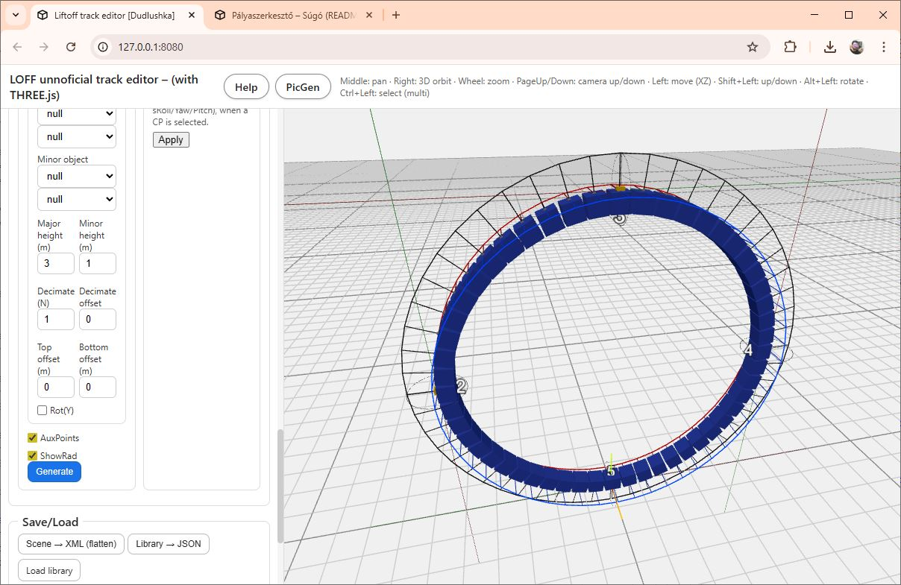
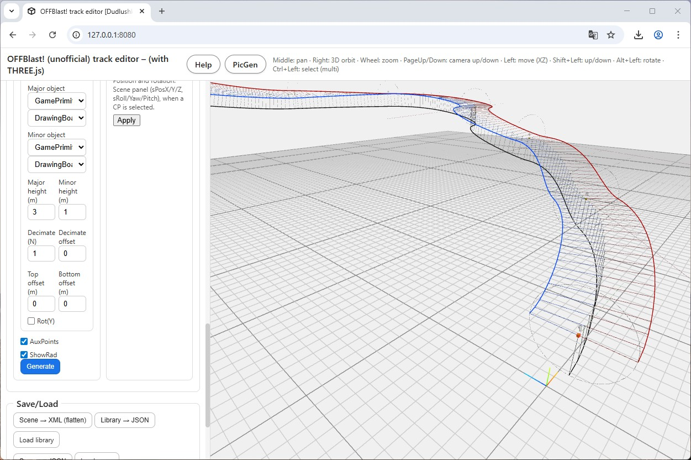
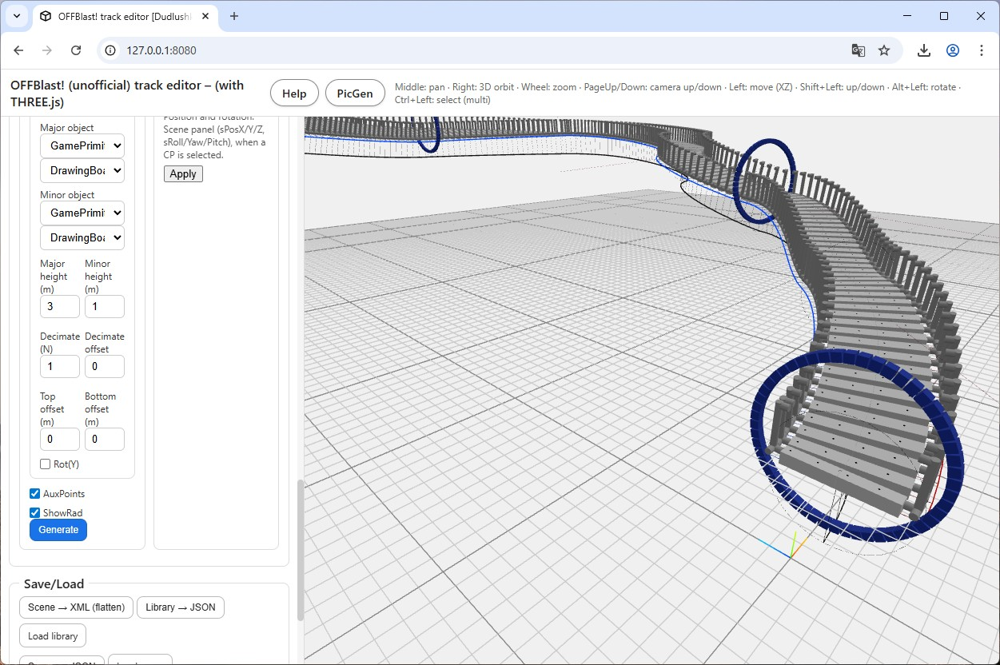

  
  

# 1. General

## Purpose of the editor

This tool is a custom track editor designed for our favorite simulator.  
Its goal is to provide a more flexible and efficient workflow for building tracks than the in-game editor, while still staying compatible with the game’s assets and logic.

The editor is built around three main views:

- **GamePrimitive Editor**
- **Group Editor**
- **Scene Editor**

Each view focuses on a different “level” of building blocks: basic shapes, reusable modules, and full tracks.

## GamePrimitive Editor

The purpose of the **GamePrimitive Editor** is to recreate the objects used by the game so that we can use them inside this custom editor.

The simulator is built on the Unity engine, and the original 3D assets are packed into internal resource files that are not directly accessible.  
Because of this, any placeable object we want to use here must first be recreated by hand as a simplified version.

Over time, more and more objects will be added to the built-in library.  
The long-term goal is to cover every important placeable object from the game.  
Until we get there, any object that does not yet exist in the library has to be modeled by the user so that it roughly matches the appearance and proportions of the in-game asset.

When the page loads, a **default library** is automatically loaded, containing the GamePrimitives I have already created.  
You can extend this library with your own GamePrimitives at any time.

If you create useful new elements, feel free to export them and share them with me – I am always happy to integrate community-made primitives into the default library.

## Terminology

The editor uses the following basic concepts:

- **(Simple) Primitive**  
  Fundamental geometric shapes (boxes, cylinders, spheres, etc.) provided by the editor.  
  These are the raw building blocks from which we construct GamePrimitives.

- **GamePrimitive**  
  A composite object built from simple primitives.  
  Each GamePrimitive represents one placeable object from the game (for example a wall segment, cone, gate, pole, etc.).  
  These are the objects that the Group and Scene editors work with.

## Group Editor mode

In **Group Editor** mode you can build more complex structures out of existing GamePrimitives.  
These structures are called **Groups**.

Typical examples:

- Building a wall section from a few elementary bricks.
- Creating a staircase, a tower module, or a corner piece from several GamePrimitives.

Groups can also use other Groups as components (nested groups), allowing you to build up more complex modules step by step.  
The only restriction is that a Group cannot include itself recursively (for obvious reasons).

## Scene Editor mode

In **Scene Editor** mode you use **GamePrimitives** and **Groups** to build your actual **Track**, similar to the game’s own editor – but hopefully a bit faster and more comfortable.

In addition to simply placing objects in 3D space, the Scene Editor supports **ControlLines** and **ControlPoints**:

- A **ControlLine** is a path in 3D space, defined by several **ControlPoints**.
- Once a ControlLine is defined, you can automatically “tile” it with GamePrimitives or Groups.
  This allows you to quickly lay out complex, “roller-coaster-like” structures – for example:
  - long curved walls,
  - snake-like tunnels,
  - elevation-changing sections,
  - or entire “roller coaster” style track segments.

With this approach you can design complex, flowing tracks in a fraction of the time it would take to place each object manually.

  
  

  
  

