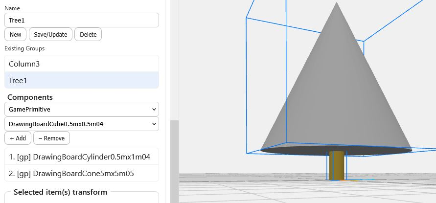
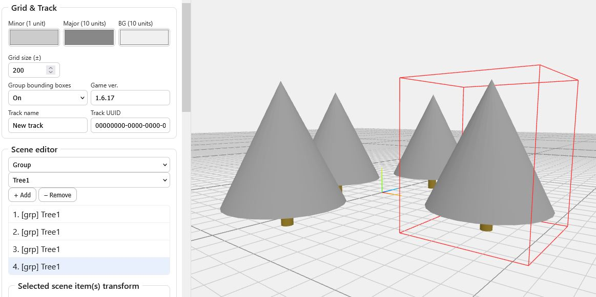
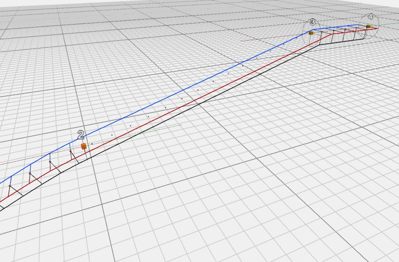
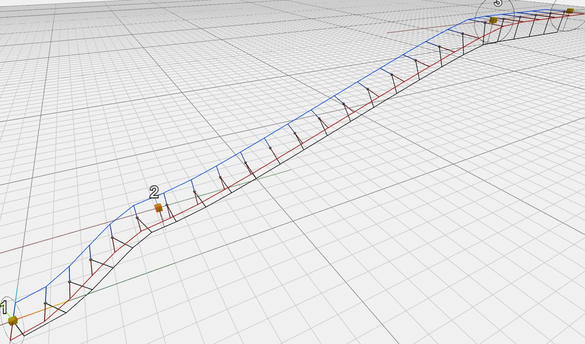
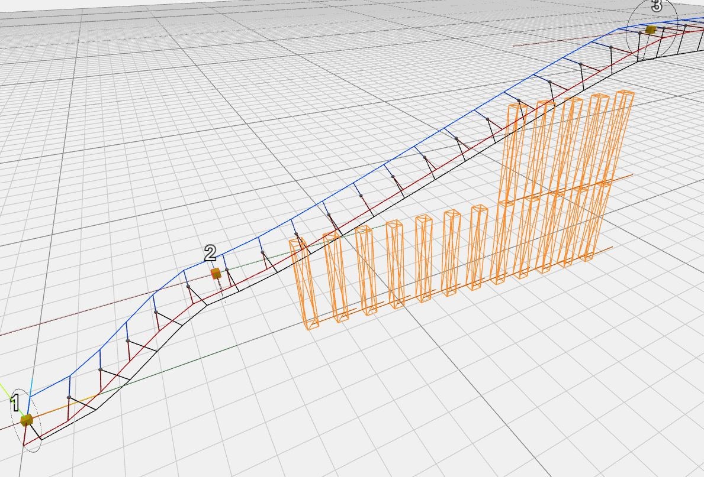
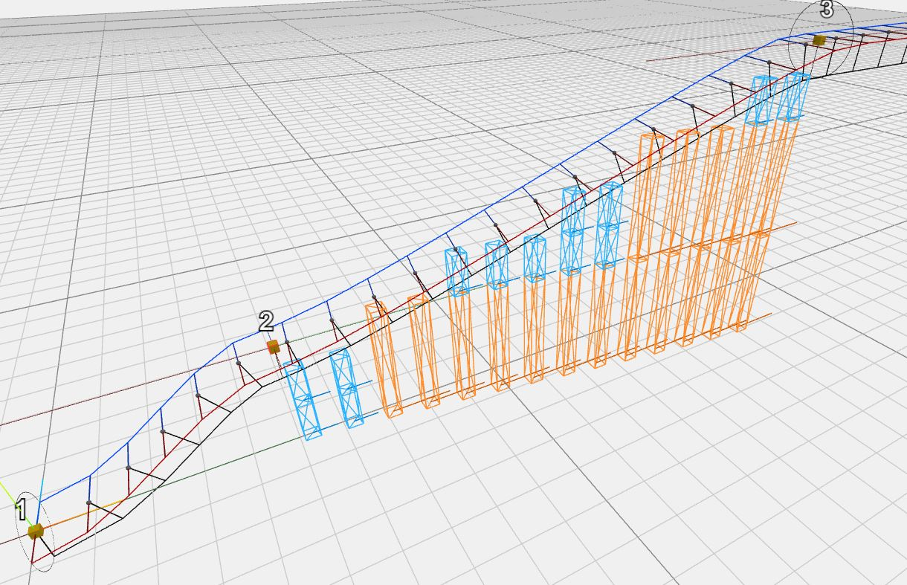
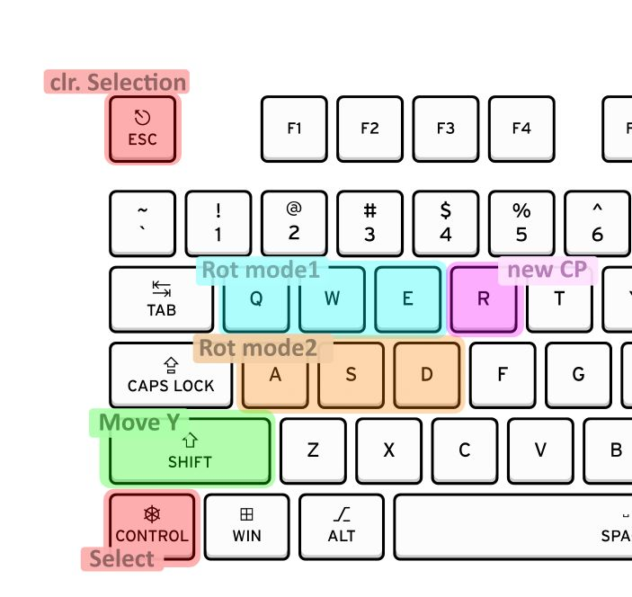
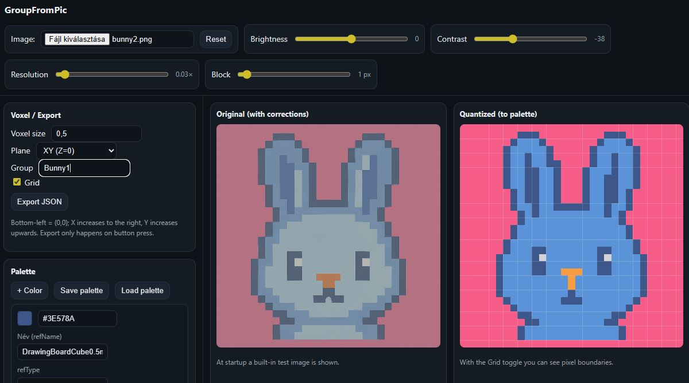
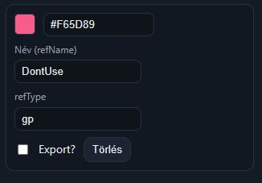
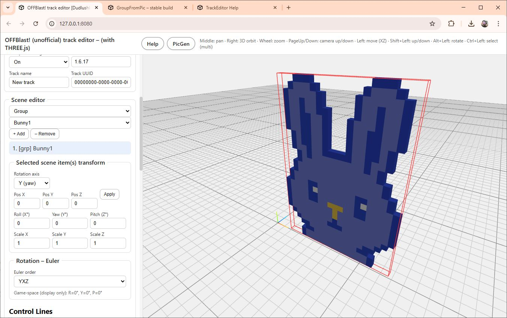

<p>
  
  
</p>

# 1. General

## Purpose of the editor

This tool is a custom track editor designed for our favorite simulator.  
Its goal is to provide a more flexible and efficient workflow for building tracks than the in-game editor, while still staying compatible with the game’s assets and logic.

The editor is built around three main views:

- **GamePrimitive Editor**
- **Group Editor**
- **Scene Editor**

Each view focuses on a different “level” of building blocks: basic shapes, reusable modules, and full tracks.


***

## 1.1. GamePrimitive Editor

The purpose of the **GamePrimitive Editor** is to recreate the objects used by the game so that we can use them inside this custom editor.

The simulator is built on the Unity engine, and the original 3D assets are packed into internal resource files that are not directly accessible.  
Because of this, any placeable object we want to use here must first be recreated by hand as a simplified version.

Over time, more and more objects will be added to the built-in library.  
The long-term goal is to cover every important placeable object from the game.  
Until we get there, any object that does not yet exist in the library has to be modeled by the user so that it roughly matches the appearance and proportions of the in-game asset.

When the page loads, a **default library** is automatically loaded, containing the GamePrimitives I have already created.  
You can extend this library with your own GamePrimitives at any time.

If you create useful new elements, feel free to export them and share them with me – I am always happy to integrate community-made primitives into the default library.


### 1.1.1. Terminology

The editor uses the following basic concepts:

- **(Simple) Primitive**  
  Fundamental geometric shapes (boxes, cylinders, spheres, etc.) provided by the editor.  
  These are the raw building blocks from which we construct GamePrimitives.

- **GamePrimitive**  
  A composite object built from simple primitives.  
  Each GamePrimitive represents one placeable object from the game (for example a wall segment, cone, gate, pole, etc.).  
  These are the objects that the Group and Scene editors work with.


## 1.2. Group Editor mode

In **Group Editor** mode you can build more complex structures out of existing GamePrimitives.  
These structures are called **Groups**.

Typical examples:

- Building a wall section from a few elementary bricks.
- Creating a staircase, a tower module, or a corner piece from several GamePrimitives.

Groups can also use other Groups as components (nested groups), allowing you to build up more complex modules step by step.  
The only restriction is that a Group cannot include itself recursively (for obvious reasons).


## 1.3. Scene Editor mode

In **Scene Editor** mode you use **GamePrimitives** and **Groups** to build your actual **Track**, similar to the game’s own editor – but hopefully a bit faster and more comfortable.

In addition to simply placing objects in 3D space, the Scene Editor supports **ControlLines** and **ControlPoints**:

- A **ControlLine** is a path in 3D space, defined by several **ControlPoints**.
- Once a ControlLine is defined, you can automatically “tile” it with GamePrimitives or Groups.
  This allows you to quickly lay out complex, “roller-coaster-like” structures – for example:
  - long curved walls,
  - snake-like tunnels,
  - elevation-changing sections,
  - or entire “roller coaster” style track segments.

With this approach you can design complex, flowing tracks in a fraction of the time it would take to place each object manually.

<p>

  
  
</p>
<p>
  
  
</p>

***
# 2. GamePrimitive Editor

The **GamePrimitive Editor** is where you define the actual building blocks that represent the game’s placeable objects.

In the long run the plan is that every important object will already be present in the built-in library.  
Until then there will inevitably be some objects that:

- exist in the game,
- but have **not yet been reverse-engineered** and added to this editor.

If you want to use such an object in your track, you can recreate it yourself as a new GamePrimitive.


### 2.1.1. When do you need to create your own GamePrimitive?

You only need to create a custom GamePrimitive if:

- the object appears in the game’s track editor,
- but you **cannot find** a matching GamePrimitive for it in this editor’s library.

In that case you can approximate the object’s shape and size using the editor’s simple geometric primitives, so that it looks and behaves *close enough* to the original in the final track.


### 2.1.2. Step-by-step: recreating an in-game object

1. **Inspect the object in the game’s track editor**

   Open the game’s own track editor and locate the object you want to use.

   For simplicity, place that object at the **origin** and reset its rotation:
   - Position: `(0, 0, 0)`  
   - Rotation: `(0, 0, 0)` on all axes

   This “neutral” pose is what you should also reproduce in the GamePrimitive Editor.

2. **Approximate its dimensions**

   To estimate the object’s main dimensions in game units:

   - Place a **second identical object** next to the first one.
   - Move it along one axis at a time (X, Y, Z) in the in-game editor.
   - Use this to determine:
     - length,
     - width,
     - height,
     - and any important offsets.

   You do not need millimetre-perfect accuracy, but you should be close enough that:
   - objects line up correctly,
   - and spacing feels the same as in the game.

3. **Rebuild the object in the GamePrimitive Editor**

   In this editor:

   - Use **simple primitives** (boxes, cylinders, etc.) to construct a composite GamePrimitive.
   - Place and scale your simple primitives so that, in the editor’s origin with zero rotation, the object:
     - matches the in-game orientation,
     - and roughly matches the measured dimensions.

4. **Use the correct in-game object name**

   The game identifies each placeable object by a specific **internal name**.  
   You need to save your GamePrimitive under that same name so that export/import works correctly.

   To find this name:

   1. In the game, create a small test track containing the object.
   2. Export the track from the game.
   3. Open the exported track file (usually XML or similar) and look for the object’s entry.  
      It will typically look like this:

      ```xml
      <TrackBlueprint xsi:type="TrackBlueprintFlag">
        <itemID>DrawingBoardCone1mx1m01</itemID>
        <instanceID>2</instanceID>
        <position>
          <x>0.2734038</x>
          <y>0</y>
          <z>3.0748744</z>
        </position>
        <rotation>
          <x>-0</x>
          <y>40.0000038</y>
          <z>-0</z>
        </rotation>
      </TrackBlueprint>
      ```

   4. The value of `<itemID>` (for example `DrawingBoardCone1mx1m01`) is the **official object name**.

   When you create your GamePrimitive in this editor, set its name to **exactly** this value.  
   Later, when you export a track from this editor, it will use this name in the generated track file, so the game can correctly map your placement to the original 3D asset.


### Default GamePrimitive library

When the page loads, the editor automatically loads a **default library** that contains the GamePrimitives I have already created.

- You can freely **extend** this library with your own primitives.
- If you create useful, well-made GamePrimitives for objects that are not yet in the default set, you can:
  - export your library,
  - and send it to me by email.

I am happy to merge good community-created primitives into future versions of the default library, so over time fewer and fewer users will need to manually recreate objects.

***
# 3. Group Editor

<p>
  
  
</p>


The **Group Editor** lets you build more complex, reusable structures out of existing **GamePrimitives** (and even other Groups).

A **Group** is essentially a prefab made of multiple objects:
- it can be placed as a single unit in the Scene Editor,
- but internally it consists of many GamePrimitives (and optionally nested Groups).


### Typical use cases


A very simple and intuitive example of a **Group**, which almost everyone ends up using at some point, is a small pine tree:

- one **cone** as the foliage, (white here: you can think of it as a snowy one).
- and one **cylinder** as the trunk 

Together these two simple primitives form a reusable “pine tree” Group, which we’ll call `tree1`, as shown in the image at the beginning of this section.

Some other examples of what Groups are good for:

- A straight wall section built from several brick-like GamePrimitives.
- A staircase assembled from repeated step modules.
- A tower, corner module, or facade element made of multiple decorative pieces.
- Any structure that you expect to use **many times** across different tracks.

By turning these into Groups instead of placing each piece manually in every track, you:

- work much faster,
- keep your tracks more consistent,
- and make future edits easier (you can update the Group once, then reuse it).


### Groups using other Groups

Groups are not limited to using only GamePrimitives.  
You can also build a Group **out of other Groups**, for example:

- First, create a `WallSegment` Group.
- Then create a `CornerModule` Group that contains two `WallSegment` instances rotated by 90°.
- Finally, build a `BuildingBlock` Group that arranges several `WallSegment` and `CornerModule` instances.

This allows you to build your content in layers:

1. Simple primitives → **GamePrimitives**  
2. GamePrimitives → **basic Groups**  
3. Basic Groups → **high-level Groups** (modules, buildings, track elements)

> Note: A Group cannot directly or indirectly contain **itself** (no recursive self-reference).  
> The editor prevents such setups, as they would lead to infinite nesting.


### Coordinate system and alignment

When placing objects inside a Group, it is recommended to think in terms of a **local origin**:

- Build the Group around `(0, 0, 0)` in a way that makes sense for snapping later:
  - For a wall, this might be the center of its base.
  - For a tower, it might be the ground-level center point.
- Keep rotations simple where possible (e.g. 0°, 90°, 180°, 270°) so that:
  - Groups are easy to align in the Scene Editor,
  - and snapping behaves predictably.

When you later use this Group in the Scene Editor, you only move/rotate **one object**, but all internal parts follow automatically.


### Naming and library

Each Group has a **name** within the editor’s library.  
It does not need to match any internal game name (unlike GamePrimitives), because Groups are a purely editor-side concept.

You can:

- Create as many Groups as you like.
- Organize them logically (e.g. `Wall_Straight_4m`, `Wall_Corner_Outer`, `Tower_3x3`, etc.).
- Reuse them across multiple tracks.

Your Groups are stored together with the rest of the editor’s data and can be exported/imported along with your GamePrimitives.

***
# 4. Scene Editor

The **Scene Editor** is where you build the actual **track** from your available **GamePrimitives** and **Groups**.

At the simplest level, this works very much like the game’s own track editor:

- you place GamePrimitives and Groups into the scene,
- move and rotate them into position,
- and gradually assemble your full track.

### Copy–paste and creating new Groups from the scene

While editing a scene, you will often find a sub-structure that you like and would like to reuse elsewhere.

In that case you have two main options:

1. **Simple copy–paste inside the Scene Editor**  
   - Select the objects you want to reuse.
   - Copy and paste them somewhere else in the same scene.
   - This is quick, but the selection only lives in this one track.

2. **Turn the selection into a reusable Group**  
   - Select the objects in the Scene Editor.
   - Copy them.
   - Switch to the **Group Editor**.
   - Create a new Group and paste the selection into it.

From that point on, this new Group becomes a reusable building block:
- you can place it multiple times in the same track,
- and also reuse it in completely different tracks.

This is the recommended workflow for anything you expect to use more than once.


## ControlLines – spline-based track building

The main advanced feature of the editor is the ability to build tracks along **ControlLines**.

You can think of a ControlLine as similar to a **spline** in a vector drawing program:

- you define a few key points (ControlPoints),
- the editor interpolates a smooth curve between them,
- and then automatically places objects along that curve.

This makes it possible to design complex, “roller-coaster-like” tracks very quickly.


### Core concepts

The ControlLine system uses the following elements:

- **ControlLine**  
  A complete path in 3D space, made up of multiple ControlPoints and the curve segments between them.

- **ControlPoint (CP)**  
  A key point on the ControlLine.  
  It defines:
  - the local position and orientation of the track,
  - optional gate/checkpoint placement,
  - and the style of the following line segment.

- **AuxPoint**  
  Automatically generated sample points **along** the line segments between ControlPoints.  
  These are used as placement positions for “line objects” (for example, repeated obstacles, railing segments, tiles, etc.).

- **MajorSupport**  
  A set of primary supports generated along the line:
  - typically larger, structural elements (e.g. main pillars under the track).

- **MinorSupport**  
  A set of secondary supports generated along the line:
  - typically smaller, denser elements (e.g. additional braces, filler supports).


### The role of ControlPoints

Each **ControlPoint** has two main responsibilities:

1. **Defining the shape of the path**
   - The positions (and orientations) of the ControlPoints determine the overall curve of the ControlLine.
   - The editor interpolates smoothly between them, so you can bend the track in any direction.

2. **Optionally placing a gate/checkpoint**
   - At each ControlPoint, you can decide whether you want to place a gate or some other special object (for example, a checkpoint structure).
   - This is controlled by the CP’s **Style** attribute.


### ControlPoint attributes

Each ControlPoint has four key attributes that affect how the path is generated and what is placed along it.

#### 1. Style

Controls whether anything is placed exactly at the ControlPoint itself:

- **Style = 0**  
  No object is generated at this ControlPoint.  
  It only influences the shape of the curve and the following segment.

- **Style = 1**  
  The selected **gate object** (GamePrimitive or Group) is placed at this ControlPoint.  
  This is typically used for gates, checkpoints, or any “main feature” that should sit exactly on the path.

You can choose which GamePrimitive/Group acts as the gate object in the editor’s settings.


#### 2. LineStyle

Controls what is generated along the **segment that starts at this ControlPoint**.

If a ControlLine has 4 ControlPoints, then it is divided into 3 segments:

- Segment 1: from CP1 to CP2
- Segment 2: from CP2 to CP3
- Segment 3: from CP3 to CP4

The **properties of each segment** are defined by the **starting ControlPoint** of that segment.  
For example, the style of the middle segment (between CP2 and CP3) is controlled by **CP2**.

The LineStyle values are:

- **LineStyle = 0 – No generation**
  - No objects are generated along this segment.
  - The path still exists mathematically, but it only serves as a reference or connector.
  
<p>
  
</p>

- **LineStyle = 1 – Line objects only**
  - “Line objects” are generated at each AuxPoint along this segment.
  - Typically this is used for simple repeating elements:
    - e.g. a sequence of cones, pillars, tiles, or small markers that follow the curve.
    
<p>
  
</p>

- **LineStyle = 2 – Line objects + Major supports**
  - Same as LineStyle 1 (line objects at AuxPoints),
  - plus **MajorSupports** are generated along the segment.
  - Major supports are usually larger structural elements (e.g. main columns supporting the track).
  
<p>
  
</p>

- **LineStyle = 3 – Line objects + Major + Minor supports**
  - Same as LineStyle 2,
  - plus **MinorSupports** are also generated.
  - Minor supports typically fill in the gaps between major supports and provide visual or structural detail (e.g. additional braces or smaller pillars).

<p>
  
</p>


### Major/Minor support heights and offsets

Both **MajorSupports** and **MinorSupports** use configurable **height/offset parameters** to determine how they are generated around the ControlLine.

Conceptually:

- At each AuxPoint on a segment, the editor knows:
  - the position of the path,
  - and the local “up/down” direction (derived from the ControlLine’s orientation).
- For each support type (Major and Minor), you can configure:
  - an **upper offset** – how far from the path the support starts or ends in the upward direction,
  - a **lower offset** – how far it extends in the downward direction (toward the ground, or below the main track).

By adjusting these offsets, you control:

- how tall the supports are,
- where they connect to the track,
- and whether they reach all the way down to the ground or stop somewhere above.

Typical use cases:

- For **MajorSupports**, you might use:
  - a small positive upper offset (so the support slightly penetrates the track geometry),
  - and a larger positive lower offset (so the support clearly reaches the ground).

- For **MinorSupports**, you might:
  - use shorter lower offsets,
  - or even keep them entirely above ground level, acting more like braces than full pillars.

The exact visual result depends on the GamePrimitives/Groups you assign as Major and Minor support objects, but the idea is always the same:
- the **offsets** move the start/end points of these supports relative to the ControlLine,
- allowing you to fine-tune how your track is supported and how detailed the structure looks.

With a combination of ControlPoints, LineStyles, and well-chosen offsets, you can very quickly generate complex, articulated track sections that would be extremely time-consuming to build by hand.


***
<p>
  
</p>

# 5. Keyboard and mouse controls

### Selection

- **Ctrl + Left click**  
  Toggle selection of an object (select / deselect).  
  At the moment, effective editing is still mostly single-object based, so don’t be surprised if multi-select feels limited.

- **Esc**  
  Clear the current selection.  
  (In the current version it’s worth pressing this a few times if something looks “stuck selected” – the visual highlighting is not always perfectly in sync with the actual internal selection state.)

- **Ctrl + A**  
  Select all objects (ControlPoints are *not* included in this “select all” operation).


### Moving objects

- **Left mouse button + drag**  
  Move the selected object(s) in the horizontal plane.

- **Shift + Left mouse button + drag**  
  Move the selected object(s) up and down (vertical movement).


### Camera controls

- **Middle mouse button + drag**  
  Pan the camera (move the view horizontally/vertically).

- **Right mouse button + drag**  
  Orbit the camera around the scene (rotate the view).

- **Page Up / Page Down**  
  Move the camera up and down.


### Rotation – editor vs. simulator

Rotation is a bit more involved because:

- the **editor** uses an internal **XYZ** Euler rotation order,
- while the **simulator** uses **YXZ**.

To help with this, there are two sets of rotation keys.


#### Q / W / E – rotation in the editor’s selected order

The editor lets you choose an Euler rotation order from a dropdown.  
Once you pick one, the **Q / W / E** keys rotate around the axes of that chosen order:

- **Q** – rotate around the first axis of the selected order  
- **W** – rotate around the second axis of the selected order  
- **E** – rotate around the third axis of the selected order  

This is useful if you want to experiment with different rotation orders inside the editor and see which one behaves more predictably for your use case.


#### A / S / D – rotation in the simulator’s YXZ order

The **A / S / D** keys always rotate using the simulator’s own **YXZ** order, mapped as:

- **A** – rotate around the **X** axis  
- **S** – rotate around the **Y** axis  
- **D** – rotate around the **Z** axis  

Use these if you want the object’s rotation to match how the simulator interprets angles as closely as possible.


#### Alt + drag (legacy rotation)

At the moment, **Alt + mouse** still triggers rotation around a user-selectable axis (chosen from a dropdown).  
This is considered a legacy / temporary control and will likely be removed soon, so it’s better to rely on the **Q/W/E** and **A/S/D** shortcuts instead.


### ControlLine editing shortcuts

- **R** – Add a new ControlPoint (CP) to the currently active ControlLine.  
  This is a quick way to extend a line without going through menu commands.


### Deletion

- **Delete** – Remove all currently selected objects.  
  (ControlPoints follow the same rule: if they are selected, they will be deleted with this key.)


***

# PicGen – pixel-art based object generator

<p>
  
</p>

In addition to the main editor, there is a separate helper tool called **PicGen**.  
PicGen can take an input image and turn it into a **pixel-art style layout** built from GamePrimitives or Groups.

In the example screenshots, a simple bunny image is imported and converted into a field of small cubes.  
Each pixel can become one or more 3D objects in the final track.


### Basic idea

PicGen works with the following concept:

- You load an image (for example a pixel-art bunny).
- The image is sampled into a grid of pixels.
- Each **pixel color** can be mapped to:
  - a simple cube,
  - a specific GamePrimitive,
  - or even a Group.

By doing this, you can think in terms of **“1 pixel = 1 object”**, and let PicGen generate complex structures based on artwork.


### Color mapping

For convenience, the tool provides a default set of **five colored cubes** as basic building blocks.

For each color in the image that you care about, you can:

- **Assign an object or Group**  
  For example:
  - all **red** pixels could be mapped to a Group containing a cluster of red tires,
  - all **blue** pixels could be mapped to small cubes,
  - etc.

- **Enable or disable generation per color**  
  If you add an extra color entry corresponding to the image **background**, you can simply **uncheck** it:
  - this tells PicGen *not* to generate any objects for pixels of that color,
  - effectively treating them as transparent / empty.

This makes it easy to isolate the interesting parts of the image (e.g. the bunny) and ignore the background.


### Image adjustments – contrast, brightness, resolution

PicGen provides a few sliders to help you tune the image before generating objects:

- **Resolution**  
  Controls how densely the image is sampled:
  - higher resolution → more pixels → more objects,
  - lower resolution → fewer, larger “blocks”.

- **Contrast**  
  Increases or decreases the contrast, helping to separate similar colors more clearly.

- **Brightness**  
  Shifts the overall brightness, which can help when images are too dark or too bright.

You can experiment with these sliders until the preview looks reasonable.  
Once you are happy with the result, you can export the voxelized layout into the main editor.


### Best practices for source images

PicGen works best if you prepare an image with its limitations in mind:

- Ideally, **one image pixel should correspond to one object** in the scene.
- Use a limited set of **clearly separated colors**.
- Avoid heavy gradients or photo-like images; instead:
  - draw or edit your image so that it looks like pixel-art,
  - use flat colors and simple shapes.

The closer your source image already is to “pixel-art”, the cleaner and more predictable the generated object layout will be.

<p>
  
  
</p>


